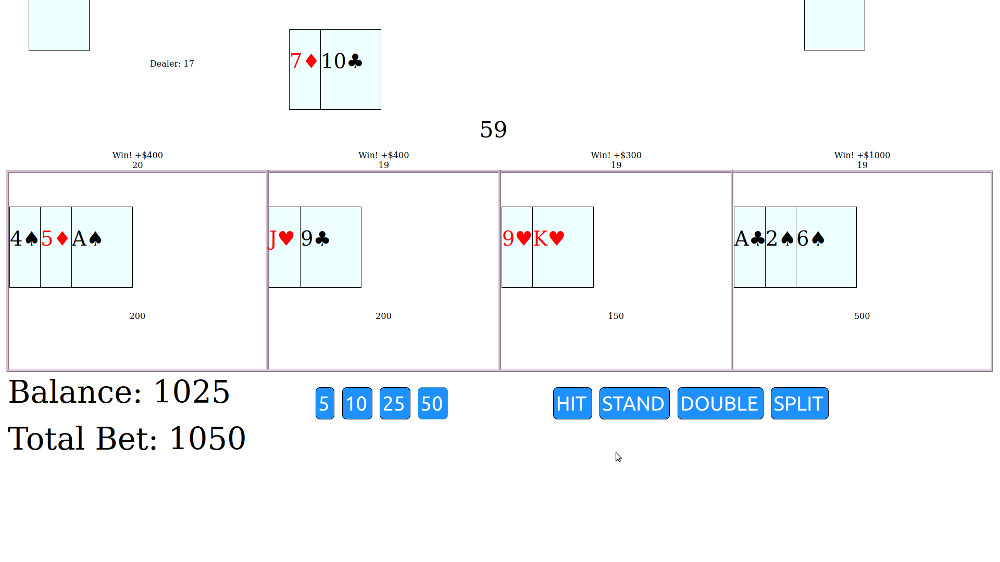

## Web-Based Multi-hand BlackJack


---
### Planning
 1. A mechanism to generate a draw pile of ```N``` number of decks
 2. Player object (position, bet, hand, split?)
 3. Card object (value, location, position)
 4. Draw pile should be random and "used"
 5. Game should be always "running", players are dealt in if they have placed a bet.
 6. Should allow Stand, Hit, Split, Double, Double after split, BlackJack
 7. Can split any faces/10s/pair only once, can double on any 2 cards. Blackjack pays 3/2 or "Push" if the dealer also has BlackJack, insurance/even money is not offered.

 ### Challenges
 1. [Timing](#javascript-game-loop)
 2. [Animation](#animation)
 3. [Responsive](#screens-and-orientation) to screen sizes/orientation
 4. [ACES](#aces-aces-aces)
 5. [Deck Generation](#random-decks)
---
<br>

### Javascript Game Loop
 * Javascript is an odd duck when it comes to synchronous programming. As a rule, everything is executed in the order it is interpreted and it only waits for as long as it has to... traditionally, advanced execution would be written as callbacks within callbacks, or by utilizing ```setTimeout``` or ```setInterval``` to control time between recursive function calls, this presents some issues with stack depth. Later we were given asynchronous functions and the ability to create a ```promise```, of which we gained the ability to ```await``` for a promise to resolve. This carries less issues, however it can be cumbersome and eat up resources that werent really required.
   - I decided to create a game loop utilizing the requestAnimationFrame event, paired with an accumulator. This allows me to not only have frame perfect timing and smoothe animation, but also the ability to compensate for dips/pauses in processing (usually due to being placed into the background or the user browsing on a separate tab).

### Animation
 * This brings us to the actual animation aspect of this simple game... Ideally, one would use a canvas and render the whole game within the canvas with an actual coordinate space. However this is a little overkill and carries additional device requirements... I simply want to create an object at one location and animate it to another location. Should be simple... right?
   - To allow for devices that may not support canvas, as well as keeping this project low on resources I opted to generating cards within the DOM(Document Object Module). Of course this means that each object could use absolute/relative/flexible positioning within the DOM. The position of any given object is also determined by its position within the heirarchy of other elements. I use a combination of attaching the dealt cards to the correct position "hand" element of a given player, and calculating the source and destination locations in screen space as well as hierarchical space... then the animating objects are added to an animation queue that is updated via the animation loop.

### Screens and Orientation
 * In the world of today, screen sizes, resolution, and orientation varies wildly when it comes to viewing content through a browser. A user should be able to use your web page on any screen size/orientation. Often separate styles or layouts are used based on weather a device is a "mobile" device or a "desktop" device. As powerful as this can be, I did not feel that it was the best solution for this application. 
   - I combat this with some of the fancy abilities of todays CSS, I use the ```calc``` function available in CSS along with the units ```vh``` and ```vw```, denoting "viewport height" and "viewport width" respectively. Sizing the overall table (no pun intended), the cards, and the font sizes with calculations based off of the actual viewport dimensions allows for a smooth, functional, and rather eye pleasing responsive display.

### ACES ACES ACES
 * In the game of BlackJack an Ace can be counted as *1* or *11*, sure... that seems straight forward. Simply add everything else first and then add an ace as 1 if it's being 11 would bust the player... how would you do this? and what happens during a hit? split? or double?
   - Initially I simply used a copy of the players hand and removed each counted card from the structure as it was counted... If the card was an Ace, it would add it to the end of the structure and then continue, unless there were no other cards available to count.. then it would simply check to see if 11 would bust the player and count the ace as 11 or 1 as needed.
   
   - The keen eyed will already be asking... What if you have 2 or more aces? is it 2 or 12? What if the player has a 4, 3 Aces, and then draws a king? My initial implementation would count these as 12, and then lock up... because it would find itself with 14, and then forever moving aces to the end... ok sure... small issue... we will just check to see if all that is left are aces and then check to see if any can be 11 or if they need to be 1 or if it wont matter either way... it was at this point I decided that removing counted cards and recycling aces until everything else has been counted was not exacly elegant...
   
   - I solved this by splitting the players hand into, cards that are aces, and everything else... I then calculate the hand total of all of the non ace cards. From here we are now able to determine weather all of the aces being 1 will bust the player or if any are able to be 11 without busting the player and how many. This solution no longer requires a loop and allows us to re-evaluate the aces without the need for doing the calculation more than once.

### Random Decks
 * I wanted to be able to generate a random drawpile for ```N``` number of decks that is able to log a seed at every shuffle, and reconstruct the exact deck that was dealt when prompted.
   - I accomplished this by looping through each suit and each card ```N``` number of times, selecting a random insertion position for the drawpale, and finally randomly swapping the position of the first 1/4 of the drawpile to account for limited insertion options as the drawpile begins. The indicies of random insertion are logged, the number of decks is logged, and the swap positions are also logged. Using this information the original deck is easily reproduced.

---

# Conclusion and the Future
* This project originally started as a single hand BlackJack game, that had no animations, no ability to split or double, and continually picked a "random" card from a "black hole" of cards... I did not feel as though it felt even close to real life random or luck, knowing the limitations of RNG(Random Number Generators)... I knew it wouldnt be just me that felt this way. I took a lot away from this in the form of reliable game loops and timing with javascript in the browser, as well as a new appreciation for how far CSS has advanced over the years.

* I plan to continue to add card/table graphics, as well as sound. Another feature I am brainstorming on how best to implement(taking screen real estate into account), is split after split. The challenge being displaying so many hands in a way that is not unruly and still functional. The back-end game supports doing this, and it is only limited at this time by the render system.

<br>

---

[Home](/README.md)