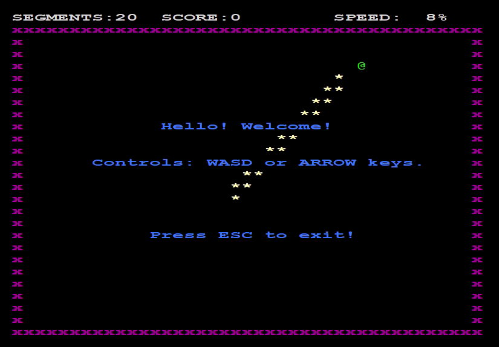
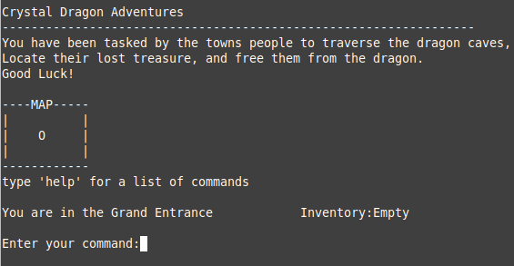
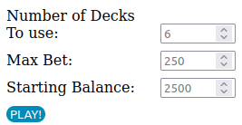

## Hi, my name is Frank.
---
This repository serves as an online portfolio to demonstrate various prgramming skills. I will be showcasing various projects, documenting initial thoughts/planning, challenges, solutions, further refinement, and future plans.
 
 

## [Snake Game](SnakeGame)
---
### Title Screen

- Displays welcome text
- Displays controls
- AI demonstraits the game in the background

  

## [Fight The Virus](FightTheVirus)
---
### Title Screen
- Displays Title
- Displays Controls
- Allows Begin/Quit

  

## [Text Based Adventure Game Platform](TextBasedAdventureGame)
---
### Title Screen

- Displays premise/objective
- Displays how to view commands
- Displays current position/inventory

  

## [Web Based Multi-Hand Black Jack](BlackJack)
---
### Title Screen

- Prompts player for game options
- Defaults to placeholder values if nothing entered
- Live Demo: [Play BlackJack](https://fjlj.xyz)
