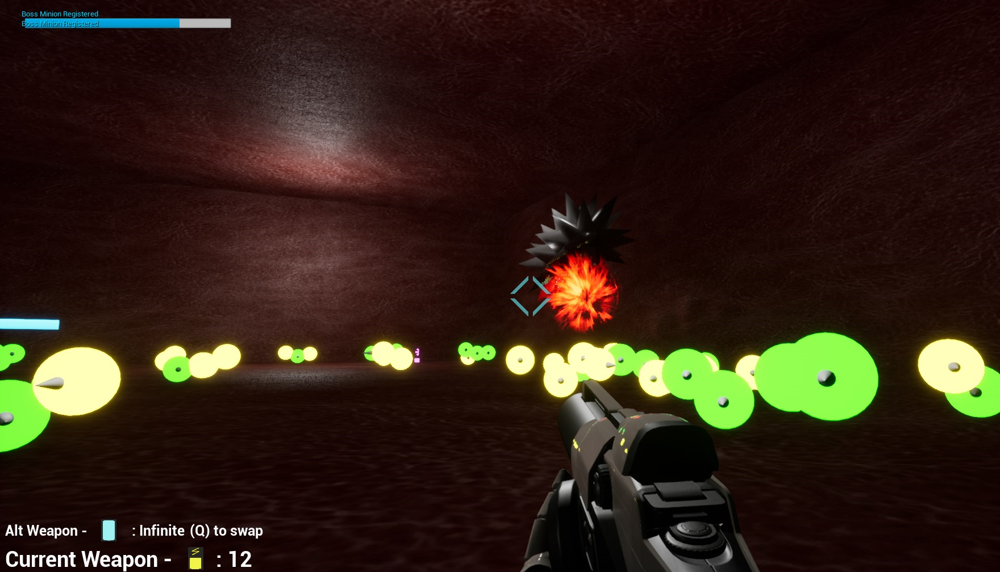
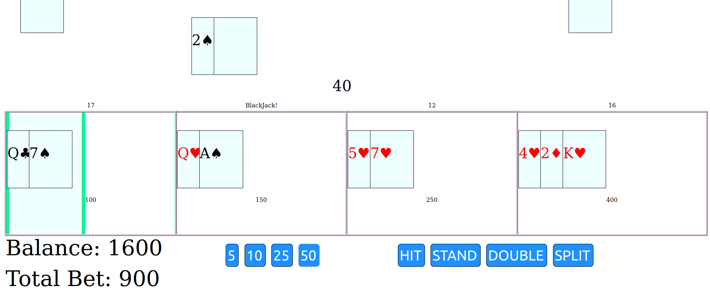

## Hi, My name is Frank Lewis.
>This repository serves as an online portfolio to demonstrate various prgramming skills. I will be showcasing various projects, documenting initial thoughts/planning, challenges, solutions, further refinement, and future plans. These four selected artifacts demonstrate various skills and abilities in regards to programming in many different languages. Things as simple as a game of snake written in C/C++ that runs in the console, can be broken down into many learning opportunities and interesting solutions. A text-based adventure game system written in python can be eye opening to how useful/powerful a scripting language and dictionaries can become. Writing a blackjack game that operates 100% in the browser on the client side, with no special dependancies or requirements, also opens the doors on a massive world of issues one faces in web-development. Finally I have also included a group project of an FPS game created in the Unreal Engine. This was one project that spoke to how amazing a team effort can be when planning and communication is a priority. Where helping eachother learn rather than watching someone fail and not offering any support can make all the difference in the progress and outcome of the project. Listed below are these 4 artifacts, each artifact has an assessment and reflection of its own that can be found via clicking their title's.

---
 

## [Snake Game](SnakeGame)

- Displays welcome text
- Displays controls
- AI demonstraits the game in the background

---
 

## [Fight The Virus](FightTheVirus)

- Displays Title
- Displays Controls
- Allows Begin/Quit
- Displays player health, weapon and ammuntion selection/amount.

---
 

## [Text Based Adventure Game Platform](TextBasedAdventureGame)

- Displays premise/objective
- Displays how to view commands
- Displays current position/inventory

---
 

## [Web Based Multi-Hand Black Jack](BlackJack)

- Prompts player for game options
- Defaults to placeholder values if nothing entered
- Player can select bet increments of 5/10/25/50
- Left clicking a player position will add the selected bet amount(up to the maximum bet)
- Right clicking a player position will subtract the selected bet amount
- Players may bet until "Place your bets" timer has ended. 
- Live Demo: [Play BlackJack](https://fjlj.xyz)
