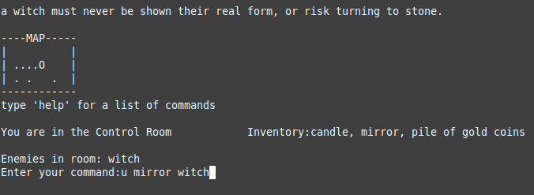

## Text-based Adventure Game Platform in Python

### Planning
 1. Multiple rooms/items/puzzles/enemies
 2. Common text based commands (walk, take, use, examine, go, run, attack, break, etc)
 3. Player inventory, random enemy encounters (if player is equipped to deal with them)
 4. Craftable Items, keys, loot, unforgivable mistakes (multiple endings)
 5. MiniMap to show were the player has been.

 ### Challenges
  1. Flexible processing of [player input](#commands-from-player-input) as valid game commands
  2. [Expandable](#level-design) map(s), rooms with different items/enemies/interactables
  3. [Smooth exploration](#immersion) of linear gameplay
  4. [The Minimap](#visuals)

---
 

  ### Commands from Player Input
   * The commands should be flexible and make intuative sense.. Although the processing of "using" an item "on" or "with" another "item" is the same symantically... the player should not have to type "use sword on enemy". Players may also get tired of typing in "move north" or "go/walk north" but these should all work the same. Finally, nobody wants to type out "attack giant rat with sword" over and over if they are unlucky enough to miss.
     - These were solved by mapping the synonimous words to the same commands utilizing a dictionary. When a command is processed the root command is looked up in the dictionary, the remaining words are filtered and processed as an item and target. Of course the number of words in a command play a major role in how a command is going to expect to need to execute. A keen observer might notice... the commands "walk north" and  "n"(also a command to walk north), are very different.. in the event of a single word command, the command is looked up with the word, and the word used for the command is passed as the first argument of the command. Thus what is actually happening when "n" is entered is move_player("n"). Finally... the last command entered is stored, in the event that "r" is passed as the command, the command will be replaced with the last command prior to command processing.

### Level Design
  * Adventure games are known for their exploration, traveling around an entire map to find items, slay enemies, and solve parts of the puzzle to advance you to your next area, is iconic to the world of adventure. That being said, a map should be easy to create, a room should be easy to define within the map and the details of said room should also be able to be added/modifies/expanded with ease.
    - To accomplish this... a map is defined in a grid system, where different characters reprisent... whatever they have been determined to define. A hallway can be completely generic and used to create the walking paths, any cell within the map that uses this character will act the same. A room can also be created as a unique character; while defining a room the ability to define interactible objects, enemies, loot, what is required to enter/leave the room, etc. is designed in such a mannor that rooms can be very simple or incredibly complex with little to no additional code requirements.

### Immersion
  * A game that is text based, can often struggle when it comes to providing an immersive playing experience. The user is required to read all/most of the information, and is expected to examine rooms/objects to unlock the details required to solve puzzles. The player will not want to read massive amounts of information all at once, and will likely be frustrated by redundant or clunky information.
    - The platform is developed in this in mind, the player is always able to see their current inventory (TODO: add a command to view inventory), the title of their current location, a list of any enemies in the room, and a list of any items available or "seen" in the room.. to gather additional information the player can e(x)amine the room, the enemies, the items, or objects in a room. The platform also allows for custom examine messages as well as room hints. Upon attempting to enter a room of which a player has not yet acquired a necessary item, the player will be relocated back to the room they came from with a message informing them of why their last movement was not allowed. This also is customizable per room. Finally, a player is not able to leave a room if they do not currently hold an item that has been configured to lock them in the room.

### Visuals
  * Although this is a text-based adventure game... the player will greatly benefit from, and appreciate any visuals that are provided. In the days of yesteryear, players would physically write down and map out the world as they traversed it. Although this was an amazing experience, in today's standards it would best be used to summon nostalgia rather than a fun play experience.
    - I added a minimap in the top left of the screen that accounts for the map the player is currently in, and acts as a "fog of war", as the players travels... the minimap will mark the minimap in the corresponding area that the player has visited that particular area, as well as show the players current location. This allows for small teleportation or map trasmissions that feel much more connected and linear than they really are. 

---

# Conclusion and the Future
 * The original assignment was to create a simple multiple(at least 3) room text-based adventure game. I knew that something simple could be put together in a matter of minutes and decided that I would set out to not only create a text-based adventure game... but to create an engine for text-based adventure games, and then create a game using it. 
   - Something that quickly became aparent was a key principle in programming and development. You can try to plan the whole project in the beginning, write the entire engine as it was outlined in the planning, and it will not only be harder... but inevitably, features will be missing, or things will need to be reworked to add additional functionality. 
   
   - After I hade though the engine was "complete", it was not until I started making a game using my new engine; I realized that I needed much much more. Sometimes the best way to get a project done or started... is to just start. Some elements of development are not entirely known until you are trying to use/define them within the context of a project.
   
   - I plan to continue expansion of this to include health, storage, additional crafting, shops, and several additional areas and puzzles. eventually I think I will host this on a simple server, that can be accessed like the old school bulletin board games.

 

---

[Home](/README.md)